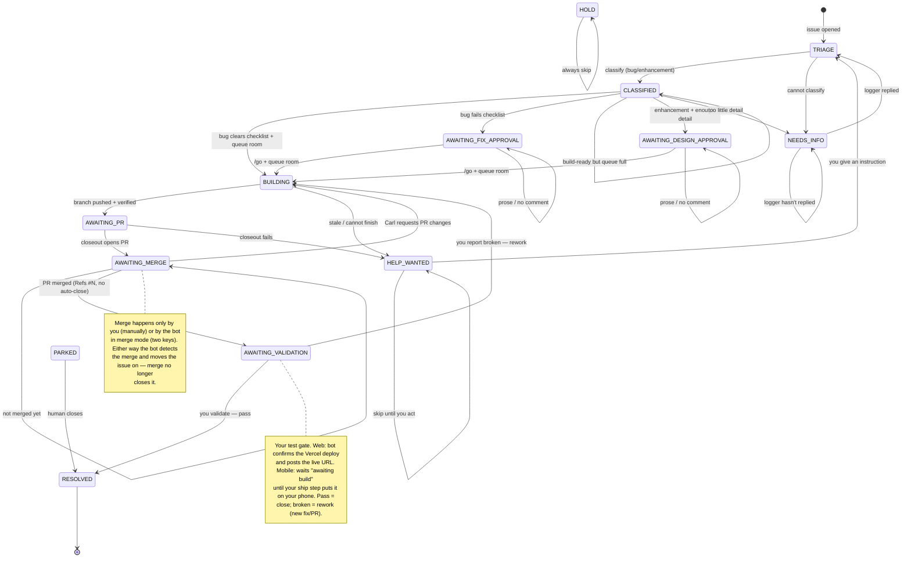

# Managed Issues — System Design

The design for turning `manage-issues` from a single unattended sweeper into a
**discipline system**: capture work without derailing live sessions, triage and
build it in batch, review it from your phone like an inbox, and never ship
anything past your gates without your say-so.

This is the agreed design from the 2026-05-29 grill session. It is the
review artifact — **nothing live changes until this is signed off.** Once it is,
we build in the four staged commits in [Build plan](#build-plan).

## Table of Contents

- [The pieces](#the-pieces)
- [State machine](#state-machine)
- [The inbox (GitHub Projects board)](#the-inbox-github-projects-board)
- [Validation and the phone cursor](#validation-and-the-phone-cursor)
- [Merge discipline](#merge-discipline)
- [Capture discipline (intake)](#capture-discipline-intake)
- [init — the reconciler](#init--the-reconciler)
- [Control commands](#control-commands)
- [Build plan](#build-plan)
- [Deliberately deferred](#deliberately-deferred)

## The pieces

Five parts, two of them skills:

| Part | What it does | Runs |
|---|---|---|
| **`init`** (mode of manage-issues) | Reconciles a repo to the desired state: labels, Projects board, the CLAUDE.md memory rule, and writes `.github/managed-issues.json` | You, deliberately, per repo |
| **`manage-issues`** (the sweep) | The unattended state machine over open issues | Hourly Routine + interactive |
| **intake skill** | Captures a session tangent into a rich GitHub issue | Background sub-agent, on demand |
| **intake memory rule** | The always-on trigger that fires intake proactively | Auto-loaded from repo `CLAUDE.md` |
| **`.github/managed-issues.json`** | Per-repo wiring (project IDs, branch, owner, phone-cursor path, version) | Read by the sweep + intake |

The two skills never talk directly — they meet only through GitHub issues and the
config file. That keeps the interactive half (capture) and the unattended half
(sweep) cleanly separated.

## State machine

The issue's label is its state; the hourly sweep is the clock; each tick takes
one guarded transition. New since the last version: **AWAITING_VALIDATION**
(your post-merge test gate) and the merge no longer auto-closes.



**States that put the ball in your court** (your inbox): NEEDS_INFO (on issues
you logged), AWAITING_DESIGN_APPROVAL, AWAITING_FIX_APPROVAL, AWAITING_MERGE,
AWAITING_VALIDATION, HELP_WANTED. Everything else is the bot's to move; it
**un-assigns you the instant the ball leaves your court**.

## The inbox (GitHub Projects board)

Your inbox is a GitHub **Projects board**, reviewed from the GitHub mobile app
(verified: board view + Status editing work on mobile via long-press → edit
field; not drag, but instant).

- **Columns:** `Triage` · `Needs you` (combined) · `Building` · `Hold` · `Done`.
- **One combined "Needs you" column** is your inbox — approvals, merges, replies,
  tests all pile here; each card's label says which action it wants.
- **Moving a card is the command, and the instant feedback.** Setting a card's
  Status moves it out of "Needs you" the moment you do it — so "answered = moved",
  no waiting on the hourly bot, no losing your place. The bot reconciles on its
  next tick.
  - → `Building` = approve & go (or retry)
  - → `Hold` = park
  - → `Done` = close
  - merge cards: you merge the PR (or → `Done` in merge mode); reply/test cards:
    you comment / validate — the bot relocates the card.
- The board is a **mirror with a few input columns**; labels stay the canonical
  state, the board Status mirrors them, and your moves out of "Needs you" are the
  only board edits the bot treats as commands.

## Validation and the phone cursor

Merge no longer means done — **your validation means done.** PRs use `Refs #N`
(not `Fixes #N`) so a merge doesn't auto-close; the bot moves the issue to
AWAITING_VALIDATION instead.

- **Web changes:** the bot waits for the Vercel deploy, then posts the **live URL**
  in the test note. You test in a browser; pass → close.
- **Mobile changes:** "deployed" can't be detected — it needs a build on your
  phone. So the **build number is a manual cursor**:
  - Merged mobile fixes sit tagged **"awaiting build."**
  - When *you* run the ship step (`homefit-ship-to-phone`, at your Mac — the sweep
    never installs), it builds, installs, and **stamps the cursor** (SHA + build N)
    into the config.
  - The bot then flips every merged mobile fix now contained in that build to
    **"test now — build N."** The ship step's numbered test list *is* your
    validation worklist.
  - Classification is exact: merged-fix SHA is an ancestor of the cursor SHA →
    testable now; otherwise → awaiting the next build.
- **Pass** = close (move to Done / `/close`). **Broken** = describe it in prose →
  the bot treats it as a fresh defect and reworks (new fix/PR; it can't reopen a
  merged PR).
- **Optional:** the bot can smoke-test on the iOS simulator first and annotate
  "passed on sim — needs your eyes on device for X", thinning your manual list.

## Merge discipline

Default: **the bot never merges.** Built PRs sit in AWAITING_MERGE.

**Two keys:**
1. **You approve which** (per issue) — `/go` on the issue, approve the PR, or move
   the card. This *marks* it; it merges nothing.
2. **Merge mode authorises the act** (per run) — only when you run in merge mode
   does the bot merge your-approved PRs.

Even in merge mode it only merges PRs that are **approved + CI-green + cleanly
mergeable + targeting `staging`**. Never `main`, never force. Prod promotion stays
its own separate gated thing (`homefit-promote-staging-to-main`). Merge mode is
off in every run by default, including the Routine. A merged PR still lands in
AWAITING_VALIDATION.

## Capture discipline (intake)

Keeps live sessions focused: tangents go to GitHub, not into the conversation.

- **Trigger:** I proactively auto-file a tangent that is a *distinct,
  scope-expanding unit of work* with a one-line notice ("Filed #123 — parking it,
  back to X"); explicit `park` / `stack` / `log` also force it; one-word pull-back.
- **How:** a **background sub-agent** writes a **rich, front-loaded** issue body
  (what surfaced, why, file paths/links, the checklist fields the sweep wants) so
  the batch sweep classifies it *positively* instead of grilling for detail.
- **It does not pre-classify** — lands bare in TRIAGE; the sweep classifies.
- **De-dups** before filing, but **biases to capture** (a near-dupe beats a lost
  capture); files to the current repo.
- **Always-on via memory:** the proactive trigger lives in the repo's `CLAUDE.md`
  (a managed section), since skills only fire when triggered. The rule fires the
  intake skill.

## init — the reconciler

Makes the system **generic** — point it at any repo and run `/manage-issues init`.
It reconciles the repo to the desired state the skill carries: check each thing,
create what's missing, update what's drifted, report, and be safe to re-run.

**Reconciles four things:**
1. **Labels** — every `status:*` label (+ `bug`/`enhancement`/`help wanted`). This
   moves *out* of the sweep into init.
2. **Projects board** — create if missing; configure the Status field columns;
   add any that drifted; link to the repo.
3. **Memory rule** — write the intake rule into the repo's `CLAUDE.md` as a marked
   managed section (`<!-- managed-issues:intake start/end -->`), so re-runs update
   it without clobbering anything.
4. **Config file** — write `.github/managed-issues.json`, the wiring + init marker.

```jsonc
// .github/managed-issues.json (shape)
{
  "version": 1,                      // definitions version, for drift detection
  "owner": "carlheinmostert",        // whose commands the bot obeys
  "integrationBranch": "staging",
  "project": {                       // GitHub Projects v2 IDs for board moves
    "number": 7,
    "id": "PVT_...",
    "statusFieldId": "PVTF_...",
    "options": { "Triage": "...", "Needs you": "...", "Building": "...",
                 "Hold": "...", "Done": "..." }
  },
  "phoneCursorPath": "docs/phone-build.json",
  "queueCeiling": 15,
  "maxNewPrsPerSweep": 5
}
```

**The sweep depends on init:** it reads the config; if missing or stale it
**fails loud** ("run `init` first") rather than half-working. (Creating a Projects
board needs the gh `project` scope — init may prompt `gh auth refresh -s project`
the first time.)

## Control commands

- **In an issue comment** (newest comment, from you, start of line): `/go`
  (approve/advance — folds in trailing notes), `/close` (resolve), `/hold` (park).
- **On the board:** move a card out of "Needs you" (see [the inbox](#the-inbox-github-projects-board)).
- **On the skill invocation:** `/manage-issues init` (reconcile a repo),
  `/manage-issues merge` (authorise merge mode for that run). Default invocation
  never merges.

## Build plan

Four staged commits to main, each independently sanity-checkable:

1. **`init` + config file** — the foundation everything else reads (labels, board,
   memory rule, `.github/managed-issues.json`). Verifiable: run it on TrainMe,
   confirm the board + labels + config appear.
2. **State-machine rewrite** in `manage-issues` — new states (AWAITING_VALIDATION),
   board sync, merge mode, depends-on-init, `Refs #N`. Verifiable: a dry sweep on
   TrainMe.
3. **Intake skill + memory rule** — the capturer + the CLAUDE.md trigger.
   Verifiable: trigger a capture in a session, see the issue land in TRIAGE.
4. **Validation wiring** — phone cursor + `homefit-ship-to-phone` reconcile + web
   Vercel-deploy detection. Verifiable: merge something, watch it reach your test
   inbox correctly per surface.

## Deliberately deferred

Raised but parked, not in this build:

- **Stale handling** — no timeout yet on NEEDS_INFO / approval gates (issues can
  sit forever waiting on a human). Candidate for a later "nudge → auto-close".
- **Priority/severity** — every issue is treated equally; no fast-lane for sev1.
- **Bot-side fix verification** beyond "tests pass" (the simulator pre-check above
  is the only nod to it).
