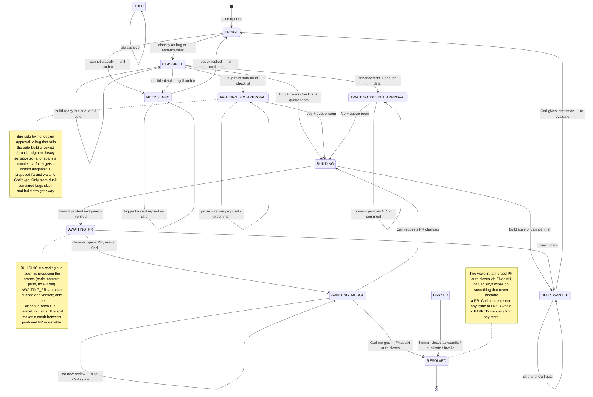

# manage-issues — State Machine

The `manage-issues` skill modelled as an explicit state machine. The issue's
label *is* its state; the unattended sweep (hourly) is the clock; each sweep
reads the state, evaluates the guards against the issue thread, and takes one
transition. This is kept in sync with [`SKILL.md`](SKILL.md).

## Table of Contents

- [How to read this](#how-to-read-this)
- [State diagram](#state-diagram)
- [States](#states)
- [Transitions](#transitions)
- [Control commands](#control-commands)
- [Auto-build checklist](#auto-build-checklist)
- [Throttle](#throttle)
- [Decisions folded in](#decisions-folded-in)

## How to read this

- **Nodes** are states, each stored on the issue as a label (or the absence of one).
- **Edges** are transitions the bot takes on a single sweep tick.
- **Edge labels** are the guard (what must be true). The action is in the
  [Transitions](#transitions) table.
- Self-loops mean "stay this sweep" (a deliberate skip or a deferral).
- `[*]` is the start (issue opened) and the end (issue gone from the open set).
- Every mutation is executed by a sub-agent; the parent only reads and verifies.

## State diagram

## States

| State | Encoded as | Ball in court | Notes |
|---|---|---|---|
| **TRIAGE** | *no labels* | bot | Entry; issue opened, not yet classified |
| **CLASSIFIED** | type label (`bug` / `enhancement`), no `status:` | bot | Classified; assessing detail or waiting for build budget |
| **NEEDS_INFO** | `status:needs-info` | issue author | Grilled; waiting on the logger's reply |
| **AWAITING_DESIGN_APPROVAL** | `status:awaiting-design-approval` | Carl | Feature spec drafted; waiting on his `/go` |
| **AWAITING_FIX_APPROVAL** | `status:awaiting-fix-approval` | Carl | Bug diagnosed but not auto-buildable; proposed fix awaits `/go` |
| **BUILDING** | `status:building` | bot (sub-agent) | Coding agent producing the branch; no PR yet |
| **AWAITING_PR** | `status:awaiting-pr` | bot (sub-agent) | Branch pushed + verified; closeout pending |
| **AWAITING_MERGE** | `status:awaiting-merge` | Carl | PR open + assigned; his merge gate |
| **HELP_WANTED** | `help wanted` | Carl | Bot stuck; skip until Carl instructs |
| **HOLD** | `status:hold` | Carl (manual) | "Bot, hands off" |
| **PARKED** | `wontfix` / `duplicate` / `invalid` | nobody | Human closed the question |
| **RESOLVED** | *issue closed* | — | Merged PR (auto) or Carl-instructed `/close` |

The **type** (`bug` / `enhancement`) is set by its own transition
(`TRIAGE → CLASSIFIED`). The **assignee** is derived from the state via the
ball-in-court rule.

## Transitions

| From | Guard / trigger | Action | To |
|---|---|---|---|
| TRIAGE | classifiable | apply `bug` or `enhancement` | CLASSIFIED |
| TRIAGE | cannot classify | grill, assign author | NEEDS_INFO |
| CLASSIFIED | bug + clears [checklist](#auto-build-checklist) + queue room | delegate build | BUILDING |
| CLASSIFIED | bug + clears checklist, queue full | none — defer | CLASSIFIED |
| CLASSIFIED | bug, enough detail, **fails** checklist | post diagnosis + proposed fix, assign Carl | AWAITING_FIX_APPROVAL |
| CLASSIFIED | enhancement + enough detail | post design spec, assign Carl | AWAITING_DESIGN_APPROVAL |
| CLASSIFIED | too little detail | grill, assign author | NEEDS_INFO |
| NEEDS_INFO | logger hasn't replied | skip | NEEDS_INFO |
| NEEDS_INFO | logger replied | remove needs-info, re-evaluate | TRIAGE |
| AWAITING_FIX_APPROVAL | `/go` (± notes) + queue room | delegate build | BUILDING |
| AWAITING_FIX_APPROVAL | prose / no comment | revise proposal or skip | AWAITING_FIX_APPROVAL |
| AWAITING_DESIGN_APPROVAL | `/go` (± notes) + queue room | fold notes, delegate build | BUILDING |
| AWAITING_DESIGN_APPROVAL | prose / no comment | post "rev N" or skip | AWAITING_DESIGN_APPROVAL |
| BUILDING | branch pushed + parent-verified | flip label | AWAITING_PR |
| BUILDING | stale / build can't finish | escalate | HELP_WANTED |
| AWAITING_PR | closeout succeeds | open PR, assign Carl | AWAITING_MERGE |
| AWAITING_PR | closeout fails | escalate | HELP_WANTED |
| AWAITING_MERGE | no new review | skip (Carl's gate) | AWAITING_MERGE |
| AWAITING_MERGE | Carl requests PR changes | delegate fix on same branch | BUILDING |
| AWAITING_MERGE | Carl merges | external — `Fixes #N` auto-closes | RESOLVED |
| HELP_WANTED | no Carl instruction | skip | HELP_WANTED |
| HELP_WANTED | Carl leaves an instruction | follow it, re-evaluate | TRIAGE |
| *any* | `/close` from Carl | bot closes the issue | RESOLVED |
| *any* | `/hold` from Carl | add `status:hold` | HOLD |
| HOLD | always | skip | HOLD |
| PARKED | human closes | — | RESOLVED |

## Control commands

Carl steers the machine with reserved commands so the bot never has to *guess*
his intent. **Commands are exact-match directives; plain prose is interpreted
content.** A command only ever moves an issue forward or parks it — to send
something back (request changes), Carl just writes prose.

Honoured only when: in the **newest non-bot comment**, authored by **Carl**
(the owner), at the **start of a line**, slash-prefixed, case-insensitive.

| Command | Effect |
|---|---|
| `/go` | Take the forward/approve edge from the current waiting state (design approval, fix approval, or unblock help-wanted). Trailing notes are folded into the build. |
| `/close` | Resolve an issue that never became a PR → RESOLVED. |
| `/hold` | Hands off → HOLD. |

## Auto-build checklist

A bug auto-builds **only if all five hold** — the concrete stand-in for "high
confidence", because the bot can't produce a calibrated probability:

1. **Root cause identified, not guessed** — exact line(s), not "probably somewhere".
2. **Contained to one unit** — single file/function, no cross-module or cross-surface ripple.
3. **Mechanical, not a judgment call** — wrong constant, missing `await`/null-check, off-by-one, typo, wrong field. Not new logic, a refactor, or a UX choice.
4. **Outside the review-before-merge zones** — publish flow, conversion listener, SyncService pull, any `CREATE OR REPLACE FUNCTION` on a client RPC.
5. **Single-surface** — the fix stays on one surface; a change that forces a matching change on a coupled surface isn't contained.

Any failure → `AWAITING_FIX_APPROVAL` (diagnosis + proposed fix, assigned to Carl).

## Throttle

Triage, grill, spec, and fix-proposals are uncapped — only autonomous code is throttled:

- **Queue ceiling (primary): 15.** Don't start new builds while ≥ 15 issues are
  already in `AWAITING_MERGE`. Bounds Carl's review queue directly, regardless
  of the hourly tick rate.
- **Per-sweep circuit breaker: 5.** Hard cap on builds started in one run, to
  bound a runaway sweep's blast radius.

The auto-build checklist is the real volume control — most bugs route to an
approval gate, so few builds fire unprompted.

## Decisions folded in

Taken 2026-05-29, resolving the original six gaps + two follow-ups:

1. **HELP_WANTED is a skip state** until Carl leaves an instruction (then re-evaluate).
2. **BUILDING split** into BUILDING (coding, no PR) + AWAITING_PR (pushed + verified, closeout pending) — crash-resumable.
3. **Added AWAITING_MERGE → BUILDING** for "Carl requested PR changes" (fix on the same branch).
4. **RESOLVED is explicit**, with two entry paths: merged PR (`Fixes #N`) or Carl's `/close`.
5. **Classification is its own transition** (`TRIAGE → CLASSIFIED`).
6. **Throttle resolved**: queue ceiling 15 (primary) + per-sweep circuit breaker 5. Hourly sweep.
7. **Auto-build is gated by an explicit checklist** (the "95% confidence" rule made concrete); bugs that fail it go to AWAITING_FIX_APPROVAL.
8. **Control vocabulary** `/go`, `/close`, `/hold` — deterministic commands so Carl's intent is never inferred.
