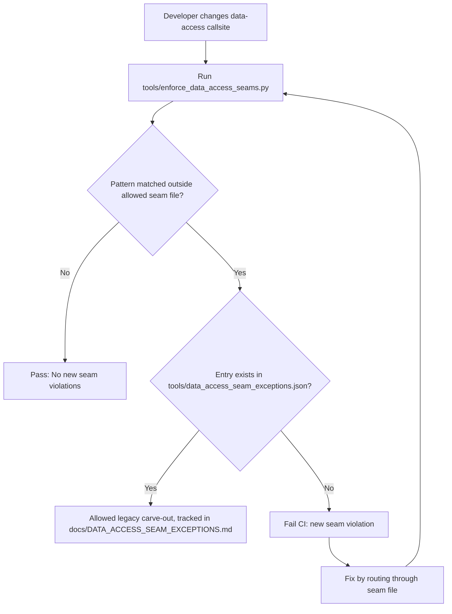
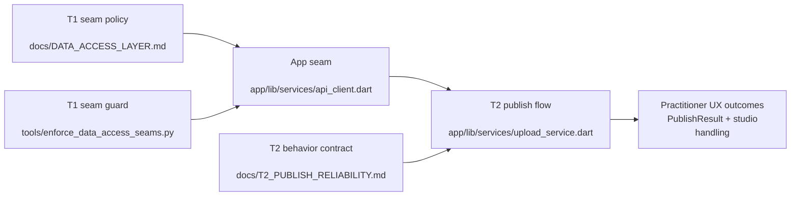

# Data access seams T1/T2 docs map

## Overview

This canvas maps how **T1 data-access seam enforcement** and **T2 publish reliability** fit together in this repository.  
It is intended as a practical navigation layer between policy docs, enforcement code, and publish-path implementation details.

Primary sources:

- `docs/DATA_ACCESS_LAYER.md`
- `docs/DATA_ACCESS_SEAM_EXCEPTIONS.md`
- `tools/enforce_data_access_seams.py`
- `tools/data_access_seam_exceptions.json`
- `docs/T2_PUBLISH_RELIABILITY.md`
- `app/lib/services/upload_service.dart`
- `app/lib/services/api_client.dart`
- `app/lib/services/auth_service.dart`
- `app/lib/services/sync_service.dart`
- `web-player/api.js`
- `web-portal/src/lib/supabase/api.ts`

---

## Table of contents

1. [T1 seam boundaries by surface](#t1-seam-boundaries-by-surface)
2. [T1 enforcement pipeline](#t1-enforcement-pipeline)
3. [T2 publish reliability map](#t2-publish-reliability-map)
4. [T1 → T2 relationship map](#t1--t2-relationship-map)
5. [Troubleshooting and checklist](#troubleshooting-and-checklist)

---

## T1 seam boundaries by surface

T1 is the “single enumerated data-access file per surface” rule, backed by CI guardrails.

| Surface | Allowed seam file | What is centralized there | Key disallowed pattern outside seam |
|---|---|---|---|
| Flutter app | `app/lib/services/api_client.dart` | Supabase RPC/table/storage access for app network path | `Supabase.instance.client` outside seam (see `tools/enforce_data_access_seams.py`) |
| Web player | `web-player/api.js` | Anon player RPC access (`get_plan_full`) | Direct `/rest/v1/` fetches outside seam (except explicit runtime seam allowances) |
| Web portal | `web-portal/src/lib/supabase/api.ts` | Typed portal/admin Supabase access | Direct `.from(...)`, `.rpc(...)`, `.storage...` ops outside seam |

Boundary references:

- Rule and rationale: `docs/DATA_ACCESS_LAYER.md`
- Current exception policy: `docs/DATA_ACCESS_SEAM_EXCEPTIONS.md`
- Executable enforcement rules: `tools/enforce_data_access_seams.py`

---

## T1 enforcement pipeline

At a high level, T1 enforcement is a static scan with explicit allowlists and explicit seam files.



### Enforcement mechanics (concrete)

- The script defines three rule families in `tools/enforce_data_access_seams.py`:
  - `flutter_direct_supabase_client` (root `app/lib`, regex `Supabase.instance.client`)
  - `web_player_direct_rest` (root `web-player`, regex `/rest/v1/`)
  - `web_portal_direct_supabase_ops` (root `web-portal/src`, regex for `.from|.rpc|.storage`)
- Approved seam files are encoded in each rule’s `allowed_files`.
- Temporary exceptions are loaded from `tools/data_access_seam_exceptions.json`.
- Human-readable policy and cleanup workflow are documented in `docs/DATA_ACCESS_SEAM_EXCEPTIONS.md`.

Operational command:

```bash
python3 tools/enforce_data_access_seams.py
```

---

## T2 publish reliability map

T2 documents and codifies publish-path behavior under partial failure, including compensation behavior.

### Canonical docs + implementation pairing

| Reliability concept | Documentation source | Primary implementation source |
|---|---|---|
| Publish result taxonomy (`success`, `preflightFailed`, `insufficientCredits`, `networkFailed`, consent gates) | `docs/T2_PUBLISH_RELIABILITY.md` | `app/lib/services/upload_service.dart` (`PublishResult`, `UploadService.uploadPlan`) |
| Credit consumption order and refund semantics | `docs/T2_PUBLISH_RELIABILITY.md` | `app/lib/services/upload_service.dart` (`consumeCredit`, `_refundCredits`) |
| Consent preflight + server backstop mapping | `docs/T2_PUBLISH_RELIABILITY.md` | `app/lib/services/upload_service.dart` (`validatePlanTreatmentConsent`, `P0003` handling) |
| Local UX propagation of failures | `docs/T2_PUBLISH_RELIABILITY.md` | `app/lib/screens/studio_mode_screen.dart` (consumer side), `app/lib/services/upload_service.dart` (payload shaping) |

### T2 publish path (code-oriented summary)

Within `app/lib/services/upload_service.dart`, publish is intentionally staged:

1. Consent and preflight gates.
2. Balance pre-check.
3. Ensure plan/client rows + atomic `consume_credit`.
4. Version bump.
5. Media upload to public bucket.
6. Exercise replace (`replacePlanExercises`).
7.5 Best-effort raw-archive uploads.
8. Best-effort issuance audit.
9. Catch path: best-effort orphan cleanup + compensating refund if debit happened.

The data seam is load-bearing here: all Supabase calls in `UploadService` route via `ApiClient` from `app/lib/services/api_client.dart`.

---

## T1 → T2 relationship map

T1 and T2 are connected: T1 enforces **where** data calls may happen; T2 specifies **how** publish-side effects and failures are handled.



### Practical implication

- If someone bypasses `app/lib/services/api_client.dart` and calls Supabase directly in `upload_service.dart` or UI code, they violate T1 and erode the single choke-point T2 depends on for predictable compensation behavior.
- If T2 behavior changes (e.g., refund timing, classification), the docs (`docs/T2_PUBLISH_RELIABILITY.md`) and seam-layer method contracts in `app/lib/services/api_client.dart` should stay aligned.

---

## Troubleshooting and checklist

### Quick triage map

| Symptom | First file to inspect | Follow-up files |
|---|---|---|
| CI fails with seam violation | `tools/enforce_data_access_seams.py` output | offending file, then seam file (`app/lib/services/api_client.dart` / `web-player/api.js` / `web-portal/src/lib/supabase/api.ts`) |
| Unsure whether exception is temporary or accidental | `docs/DATA_ACCESS_SEAM_EXCEPTIONS.md` | `tools/data_access_seam_exceptions.json` |
| Publish result seems misclassified | `docs/T2_PUBLISH_RELIABILITY.md` | `app/lib/services/upload_service.dart` (`PublishResult`, `uploadPlan` catch/return paths) |
| Credits charged unexpectedly after failed publish | `app/lib/services/upload_service.dart` (`creditConsumed`, `_refundCredits`) | `docs/T2_PUBLISH_RELIABILITY.md` compensation notes |
| Treatment consent behavior diverges from expectation | `app/lib/services/upload_service.dart` (Step 0/0a + `P0003` handling) | `docs/T2_PUBLISH_RELIABILITY.md`, `app/lib/services/api_client.dart` consent RPC methods |

### Maintenance checklist (T1 + T2-safe)

- [ ] New Supabase access in app code is added via `app/lib/services/api_client.dart` only.
- [ ] New Supabase access in web player is added via `web-player/api.js` only.
- [ ] New Supabase access in web portal is added via `web-portal/src/lib/supabase/api.ts` only.
- [ ] `python3 tools/enforce_data_access_seams.py` passes locally.
- [ ] If a carve-out is unavoidable, update both:
  - `tools/data_access_seam_exceptions.json`
  - `docs/DATA_ACCESS_SEAM_EXCEPTIONS.md`
- [ ] T2 publish behavior changes are reflected in:
  - `docs/T2_PUBLISH_RELIABILITY.md`
  - `app/lib/services/upload_service.dart` implementation and result mapping

---

## Notes

- This canvas is intentionally docs-first and path-heavy so contributors can jump to source immediately.
- It does not replace the canonical specs in `docs/DATA_ACCESS_LAYER.md` and `docs/T2_PUBLISH_RELIABILITY.md`; it maps them.
